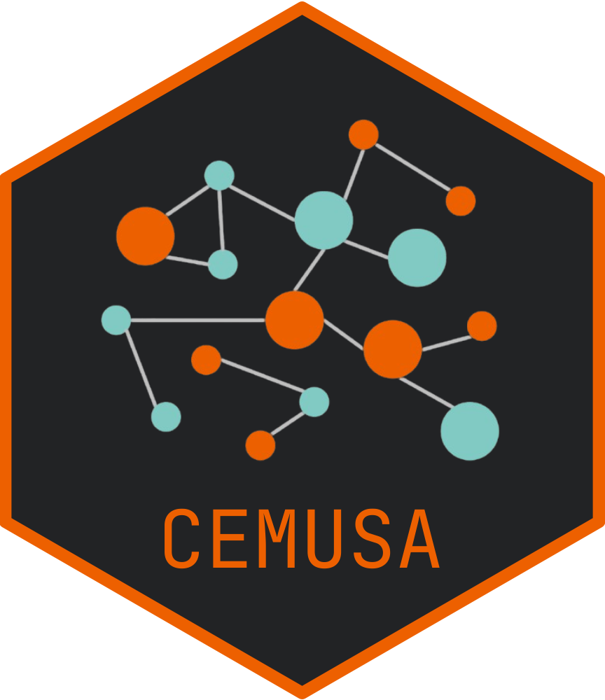

# CEMUSA: **C**omprehensive **E**valuation **M**etric for **U**nsupervised **S**patial **A**nnotation

We propose **C**omprehensive **E**valuation **M**etric for **U**nsupervised **S**patial **A**nnotation
(`CEMUSA`) to evaluate spatial clustering results from ST data. It addresses the limitations of existing clustering evaluation metrics by accounting for label agreement, spatial
locations, and error severity simultaneously.

## Installation
### 1. Install the package from GitHub
```r
if (!requireNamespace("devtools", quietly = TRUE)) {
  install.packages("devtools")
}
devtools::install_github("YihDu/CEMUSA")
```

### 2. Load the package
```r
library(CEMUSA)
```

## How to use `CEMUSA`
Please refer to the [documentation](https://yihdu.github.io/CEMUSA) for details.
