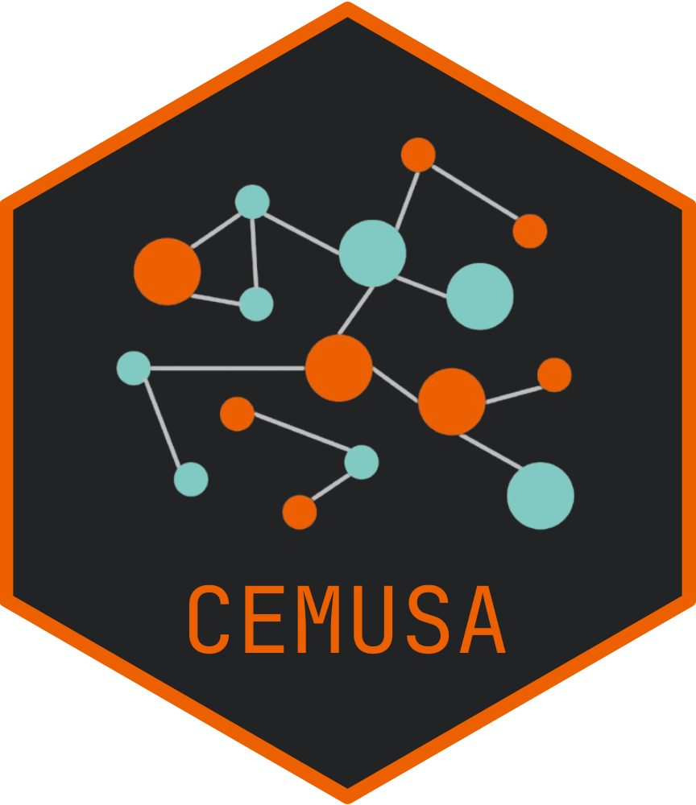

# CEMUSA 

## Introduction

`CEMUSA` is a evaluation metric for Spatial Transcriptomics data. It addresses the limitations of existing clustering evaluation metrics by accounting for label agreement, spatial
locations, and error severity simultaneously.

## Installation

To install the package from GitHub, use the following command:

```r
# Install the package from GitHub
if (!requireNamespace("devtools", quietly = TRUE)) {
  install.packages("devtools")
}
devtools::install_github("YihDu/CEMUSA")
```

## CEMUSA

```r
library(CEMUSA)
CEMUSA(true_labels, cluster_labels, spatial_coordinates , match_cluster_labels = TRUE , params = list)
```

## Parameters
- `true_label` :  
  A vector containing the ground truth labels, used as a reference.

- `cluster_labels` :   
  A vector containing the cluster labels to be evaluated.

- `spatial_coordinates` :   
  A matrix or data frame containing the spatial coordinates (e.g., `x`, `y`) of each data point.

- `match_cluster_labels` : (default =  `TRUE`)    
  A boolean value..If `TRUE`, the function  will attempt to match the `cluster_labels` with the `true_labels` using an internal matching function. This is useful when the labels are not already matched (e.g., matched by external information like marker genes).

- `params` : (optional)   
  A list of additional parameters that control more detailed aspects of the evaluation.

## Returns:
  A MMD-based (maximum mean discrepancy) score, ranging from 0 to 2, where smaller values indicate better alignment.

## Example Usage
Click [here](https://github.com/YihDu/CEMUSA/tree/main/data-raw) to download the data used in the example below.

### Example 1: Basic Usage
```r
# Reproduce the Case I in the paper
load('Simulate_Case_CenterEdge.RData')

metadata <- seurat_object@meta.data
coordinates <- metadata[, c("spatial_x", "spatial_y")]
truth_labels <- metadata$truth_label
pred_labels_edge <- metadata$edge_error

CEMUSA = CEMUSA(true_labels = truth_labels, 
           cluster_labels = pred1_labels , 
           spatial_coordinates = coordinates , 
           match_cluster_labels = FALSE)
```

### Example 2: When considering the Error Severity
```r
# Reproduce the Case II in the paper
data <- read.csv('Simulate_Case_Severity.csv')

dict_severity_levels1 <- list(
  list(name = "Normal", severity_level = 1),
  list(name = "Cancer", severity_level = 2)
)

truth_labels = data$truth_label
pred_labels_FP = data$FP_error
coordinates = data[, c("x", "y")]

params <-list(
  apply_anomaly_severity_weight = TRUE,
  severity_weight_dict = dict_severity_levels1
)

CEMUSA = CEMUSA(
  true_labels = truth_labels , 
  cluster_labels = pred_labels_FP , 
  spatial_coordinates = coordinates,
  params = params)
```

<!-- ## Cite `CEMUSA`
Jiaying Hu<sup>†</sup>, Yihang Du<sup>†</sup>, Suyang Hou, Yueyang Ding, Hao Wu and Xiaobo Sun<sup>†</sup>&#35;.*SAS:A clustering evaluation metric for spatial transcriptomics.*,2025 -->


